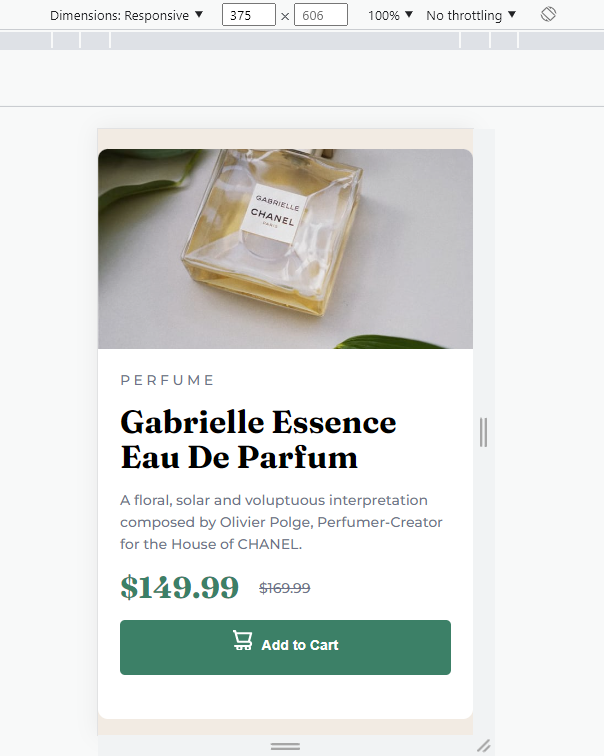
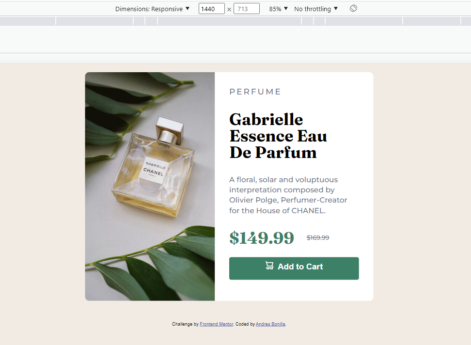

# Frontend Mentor - Product preview card component solution

This is a solution to the [Product preview card component challenge on Frontend Mentor](https://www.frontendmentor.io/challenges/product-preview-card-component-GO7UmttRfa). Frontend Mentor challenges help you improve your coding skills by building realistic projects. 

## Table of contents

- [Overview](#overview)
  - [The challenge](#the-challenge)
  - [Screenshot](#screenshot)
  - [Links](#links)
- [My process](#my-process)
  - [Built with](#built-with)
  - [What I learned](#what-i-learned)
  - [Continued development](#continued-development)
  - [Useful resources](#useful-resources)
- [Author](#author)
- [Acknowledgments](#acknowledgments)

## Overview
Create a product card that adapts to large desktop and mobile devices without losing detail
### The challenge

Users should be able to:

- View the optimal layout depending on their device's screen size
- See hover and focus states for interactive elements

### Screenshot




### Links

- Solution URL: [Add solution URL here](https://your-solution-url.com)
- Live Site URL: [Add live site URL here](https://test-rdw-product-detail.netlify.app/)

### Built with

- Semantic HTML5 markup
- CSS custom properties
- Flexbox
- CSS Grid
- Mobile-first workflow

### What I learned

Mainly strengthening knowledge in Flexbox and media queries

```css
@media (min-width:1440px) {
  .card-container {
    height: auto;
    display: flex;
    justify-content: space-between;
  }

  .card-image-container {
    flex: 50%;
    width: 100%;
    height: 555px;
    background-image: url('/images/image-product-desktop.jpg');
    background-size: cover;
    background-position: center;
    background-repeat: no-repeat;
    border-radius: 10px 0 0 10px;
  }
}
```

If you want more help with writing markdown, we'd recommend checking out [The Markdown Guide](https://www.markdownguide.org/) to learn more.

### Continued development

Constant learning in Responsive Web Design, pure CSS and its Frameworks such as Boostrap
Frontend Roadmap

## Author

- Frontend Mentor - [@yourusername](https://www.frontendmentor.io/profile/abonilla4)
- Twitter - [@aabonilla](https://www.twitter.com/aabonilla)